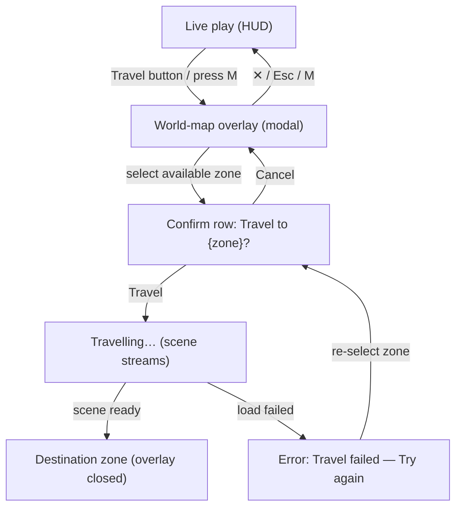

# World-map & fast-travel overlay — UX spec

The UX/IA reference for the **world-map / fast-travel overlay** (E3.1-UX,
[FLO-331](/plan/game-plan)). This is the design-side companion to
[World map & zones](./world-map), which documents the zone registry and the
`planTravel` data flow. Read that first for the model; this doc owns the
**interaction design, wireframes, states, layout, tokens, and accessibility**.

> **Status — documents shipped reality.** The overlay was implemented in
> FLO-332 (PR #46) and FLO-390 as `src/components/WorldMap.tsx`. This spec is the
> canonical UX source of truth: it both specifies the design and records a
> design review of the shipped component, with the one craft gap fixed in the
> same change (see [Design review](#design-review-of-the-shipped-overlay)).

---

## 1. Job-to-be-done

> _"I'm done in this zone — take me to another part of the world without making
> me walk there, and don't let a stray click teleport me by accident."_

The overlay is a **modal travel picker**, not a strategic map. It answers three
questions at a glance (Recognition over Recall, Information Scent):

1. **Where am I now?** → current-zone marker.
2. **Where can I go?** → available zones, clearly separated from locked ones.
3. **What happens if I pick one?** → a deliberate two-step confirm before travel.

Scope is intentionally small (Occam's Razor): four zones, no pan/zoom, no routes.
A spatial/illustrated map is a future delighter (Kano), not a must-have.

---

## 2. Information architecture



**Zone taxonomy** (from the registry — game-plan §0):

| Id | Display name | Lore name | Owner | Travel status |
| -- | ------------ | --------- | ----- | ------------- |
| `human-lands` | Human lands | The Salt Road of Velya | Neutral | available |
| `forest` | Forest | The Emerald Thicket of Lysaen | Forest Elves | available |
| `empire` | Empire | The Imperial March | The Emperor | locked |
| `mountains` | Mountains | Black Crown Pass | The Villain | locked |

Display order is fixed (registry order) so the grid is spatially stable between
opens (Jakob's Law — the map never reshuffles under the player's muscle memory).

---

## 3. Layout (1280×800 laptop)

A centered modal over a dimmed scrim, never full-bleed — the player stays
oriented in the world behind it (the live scene shows through the 60%-opacity
scrim). Single panel, `min(48rem, 100vw − 2rem)` wide, capped to the viewport
height. The four zones sit in a **2×2 grid** (`grid-template-columns: repeat(2,
1fr)`), which keeps every card a comfortable click target and avoids a tall
single-column list on a wide laptop (Fitts's Law, F-pattern scan).

```
┌──────────────────────── scrim (rgba(6,10,14,.6)) ───────────────────────┐
│                                                                          │
│        ┌──────────────────── worldmap-panel ────────────────────┐       │
│        │  World map                                        [ ✕ ] │ ← header
│        │                                                         │       │
│        │  ┌───────────────────────┐  ┌───────────────────────┐  │       │
│        │  │ Human lands           │  │ Forest                │  │       │
│        │  │ The Salt Road of Velya│  │ The Emerald Thicket…  │  │       │
│        │  │ Neutral               │  │ Forest Elves          │  │       │
│        │  │ [ YOU ARE HERE ]      │  │                       │  │ ← 2×2  │
│        │  └───────────────────────┘  └───────────────────────┘  │   grid │
│        │  ┌───────────────────────┐  ┌───────────────────────┐  │       │
│        │  │ Empire        (dimmed)│  │ Mountains     (dimmed)│  │       │
│        │  │ The Imperial March    │  │ Black Crown Pass      │  │       │
│        │  │ The Emperor           │  │ The Villain           │  │       │
│        │  │ [ LOCKED ]            │  │ [ LOCKED ]            │  │       │
│        │  └───────────────────────┘  └───────────────────────┘  │       │
│        │                                                         │       │
│        │  Select a zone to travel.                               │ ← footer
│        └─────────────────────────────────────────────────────────┘       │
│                                                                          │
└──────────────────────────────────────────────────────────────────────────┘
```

Each **zone card** is one button (the whole card is the hit target — Fitts) with
a three-line stack: **display name** (primary, 1.05rem/700), **lore name**
(secondary, sage `#c7d2a2`), **owner** (tertiary, 75% opacity), plus an optional
status pill. The footer is a **single live region** that swaps between hint /
confirm / loading / error — one fixed slot (`min-height: 2.75rem`) so the panel
never reflows as state changes (no layout jump = Doherty/perceived stability).

---

## 4. States (all five, with wireframes)

The overlay must render every state with equal care — a beautiful happy path
with a raw empty/error state is a broken product.

### A · Default (no selection)

Current zone carries the green **YOU ARE HERE** pill and is non-selectable
(`is-current`, disabled). Locked zones are dimmed (opacity .5) with a red
**LOCKED** pill and are non-selectable. Footer hint: _"Select a zone to travel."_

### B · Selected → two-step confirm

```
│  ┌ Human lands ─┐  ┌ Forest ════════┐  ← selected: gold border + gold-tint fill
│  │ YOU ARE HERE │  │ (is-selected)  │
│  └──────────────┘  └────────────────┘
│  ┌ Empire LOCKED┐  ┌ Mountains LOCK ┐
│  └──────────────┘  └────────────────┘
│
│  Travel to Forest?   [ Travel ]  [ Cancel ]   ← primary | secondary
```

Selecting an available zone highlights it (gold `#f7d774` border + tint) and
replaces the footer hint with a **confirm row**: prompt + a **primary** `Travel`
button and a **secondary** `Cancel`. This two-step gate (Forgiveness / error
prevention — Nielsen #5) means a stray click only _selects_; travel always takes
a second, deliberate confirm. `Cancel` returns to the default footer with the
selection cleared.

**Primary vs secondary must be visually unambiguous** (Von Restorff, visible
hierarchy): `Travel` is a solid gold button (`#f7d774` fill, dark `#1a1206`
text); `Cancel` is the ghost/secondary style. See the design-review fix below.

### C · Loading (travel in progress)

```
│  …all four zone cards disabled (dimmed, not-allowed)…
│
│  Travelling…                                  ← status, no spinner-of-doom
```

On confirm, every zone card disables (`busy`) so the player can't queue a second
travel mid-stream, and the footer shows _"Travelling…"_. Target is the Doherty
threshold; if streaming can exceed ~400ms, the implementer should add a subtle
indeterminate progress affordance (skeleton/animated ellipsis) — text-only is
acceptable for the current short hops but should not regress on heavier zones.

### D · Error (load failed)

```
│  …zones re-enabled, last selection still highlighted…
│
│  Travel failed — the zone could not be loaded. Try again.   ← role="alert", salmon
```

Failure re-enables the cards and shows a salmon `role="alert"` message
(`#e0817a`/`#f3b0a8` family). Recovery is **forgiving**: the player re-selects
the zone to get the confirm row again. _Copy note:_ "Try again" currently implies
a button that isn't literally present — recovery is re-selecting the card. Keep
the copy honest or add a literal **Retry** button in the confirm slot (tracked as
a follow-up, not blocking).

### E · Empty (no zones registered)

```
│  No zones are available to travel to yet.
│
│  Select a zone to travel.
```

Defensive state for a registry with zero zones (should not occur in normal play,
but the component handles it). Plain, calm copy — no error styling, because an
empty registry is not the player's fault.

---

## 5. Tokens

Korovany has **no CSS-variable token layer yet** — colours are inlined per
component but drawn from a consistent de-facto palette established by the menu &
HUD (`src/styles/global.css`). The overlay reuses that palette; the table below
names the values so handoff is unambiguous. _System recommendation: promote
these to CSS custom properties (`--accent-gold`, `--text-primary`, …) in a
future pass so the overlay, menu, and HUD share one source — out of scope here,
noted for the design system._

| Role | Value | Used for |
| ---- | ----- | -------- |
| Scrim | `rgba(6,10,14,.6)` | overlay backdrop |
| Panel bg | `rgba(10,16,20,.9)` | modal surface |
| Panel border | `rgba(255,255,255,.18)` | modal edge |
| Accent gold | `#f7d774` | selection, hover, focus, primary button |
| Primary text on gold | `#1a1206` | `Travel` button label |
| Text primary | `#f8fafc` | zone names, controls |
| Text secondary (lore) | `#c7d2a2` | lore subtitle |
| Text muted | `#d9e3ea` / 75% opacity | owner line, hints |
| Success | `rgba(120,200,120,*)` | YOU ARE HERE pill |
| Danger | `rgba(200,120,120,*)` | LOCKED pill |
| Error text | `#f3b0a8` | travel-failed alert |
| Radius | `8px` panel · `6px` cards/buttons · `999px` pills | — |
| Card gap | `0.75rem` | grid gutter |
| Panel padding | `1.5rem` | — |

Spacing uses the existing `rem` rhythm (`0.2 / 0.35 / 0.75 / 1.25 / 1.5rem`);
no new one-off values were introduced.

---

## 6. Interaction & input

- **Open:** HUD **Travel** button, or press **M** during live play.
- **Close:** **✕** button, **Esc**, or **M** again — all return to live play
  without travelling (multiple exits = Nielsen #3 user control / Forgiveness).
- **Select:** click/tap a zone card, or keyboard-focus + Enter/Space.
- **Confirm:** `Travel` commits; `Cancel` clears the selection.
- **Disabled targets:** current zone and locked zones are `disabled` +
  `aria-disabled` and never receive selection.

---

## 7. Accessibility (WCAG POUR)

- **Role/modality:** `role="dialog"`, `aria-modal="true"`,
  `aria-labelledby="worldmap-title"`. The panel is the labelled dialog.
- **Live region:** the footer is `aria-live="polite"`; the error uses
  `role="alert"` so failures are announced.
- **State, not just colour:** selection carries `aria-pressed`; disabled carries
  `aria-disabled`; current/locked status is conveyed by the **text pill**, not
  colour alone (colour-independence — a colour-blind player still reads "YOU ARE
  HERE" / "LOCKED").
- **Focus:** `:focus-visible` gets the same gold ring as hover; targets are
  full cards / ≥2.5rem buttons (touch & motor accessibility).
- **Contrast:** gold-on-dark and light-text-on-panel clear AA for the text sizes
  used; the `Travel` primary uses dark text on gold for AA on the fill.
- **Reduced motion:** the overlay currently uses no transitions; if a fade-in is
  added later, gate it behind `prefers-reduced-motion: reduce`.

---

## 8. Design review of the shipped overlay

Rendered `WorldMap.tsx` + its real CSS at **1280×800** (default, confirm, and
error states). Verdict: **solid visual craft — coherent with the menu palette,
clear hierarchy, all five states handled.** One concrete gap, fixed in this
change:

- **FIXED — primary action had no emphasis.** The confirm row's `Travel` button
  used a `.primary-action` class that was **undefined in CSS**, so `Travel` and
  `Cancel` rendered at identical weight — the player couldn't tell the primary
  action at a glance (fails the "primary visible in two seconds" bar; Von
  Restorff). Added a `.primary-action` rule (solid gold fill, dark label) so the
  commit action visually dominates `Cancel`. CSS only; no behaviour change.

Non-blocking follow-ups (logged for the owning engineer, not gating this spec):

- **Error "Try again" wording vs affordance** — copy implies a button; recovery
  is re-selecting the card. Either soften the copy or add a literal **Retry** in
  the confirm slot (state D).
- **Loading affordance on heavy zones** — text-only "Travelling…" is fine for
  current short hops; revisit with a progress/skeleton cue if zone streaming can
  exceed the Doherty ~400ms threshold (state C).
- **Token layer** — promote the inlined palette to CSS custom properties shared
  with the menu/HUD (system-level, §5).

---

## 9. Acceptance (for the implemented overlay)

- [x] All four zones listed as travel targets, in stable registry order.
- [x] Current-zone indicator (YOU ARE HERE) + available vs locked distinction,
      conveyed by text pill (not colour alone).
- [x] Two-step select → confirm/cancel travel affordance.
- [x] Empty / loading / error states all handled and styled.
- [x] Usable at 1280×800; reuses visual-language v1.2 palette.
- [x] Primary `Travel` action visually dominant over `Cancel` (this change).
